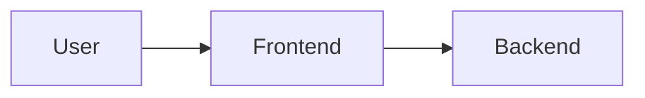
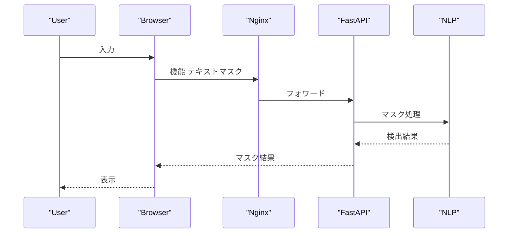

# System Architecture (Draft)

## 目的

本ドキュメントは個人情報を検出・マスクするWebアプリの全体構成を定義

## 構成図

## シーケンス（主要機能）

## コンポーネント概要
- Frontend: UI と静的配信
- Backend: API と処理

## デプロイ

## 可観測性
- 構造化ログ（リクエストID、処理時間、検出件数）

## セキュリティ/プライバシー

## 非機能

